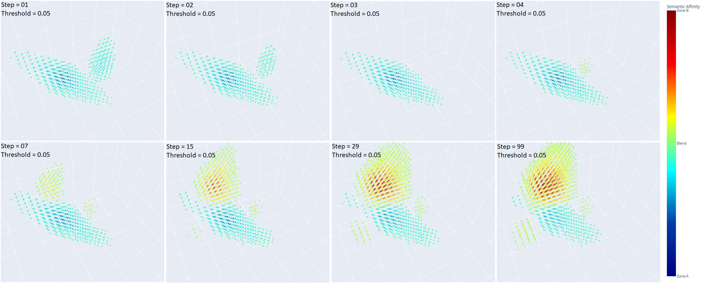

# Experiment 04: Semantic Drift and Divergence Under Adaptive Projections

**Related source code**  

The source code of the experiment is: /examples/ex04_minimal_hpm_semantic_drift_and_divergence.py  

*Additional:*  
The visualization code for the final memory field state at each phase is: /examples/ex04_visualise_memory_state.py  
The visualization code for the memory dynamics at each phase is: /examples/ex04_visualise_memory_dynamic.py  

**Objective**

To investigate how Holographic Projection Memory (HPM) reorganizes and adapts its internal semantic structure when exposed to sequential, conflicting projection targets. This experiment focuses on whether previously satisfied goals can be reinstated after interference, and how projection geometry responds to shifting semantic constraints. It examines the system's capacity for semantic drift, topological divergence, and adaptive conflict resolution under continuous delta-based updates.

---

## Experimental Setup

* **Memory Configuration**: A 3D memory field of shape $64 \times 64 \times 64$ with $C = 16$ semantic channels.

* **Projection Setup**:

  * Two projection beams, A and B, are defined by fixed (initial) origins and distinct directions.
  * Beam A is held fixed across all stages.
  * Beam B’s target is gradually made orthogonal to A across stages, with its geometry becoming learnable in Stage C.
  * **Importantly, the projection paths of A and B intersect within the memory field** - ensuring that semantic interference and spatial conflict can occur. This overlapping geometry is crucial for eliciting measurable divergence and testing conflict resolution.

* **Target Embeddings**:

  * Beam A is assigned a fixed random target vector $T^*_A$.
  * Beam B receives:

    * A partially mixed variant of $T^*_A$ during Stage A (to avoid early conflict),
    * An orthogonalized vector in Stage B,
    * A new orthogonal vector in Stage C.

* **Update Rule**:

  * Delta-Learning is used throughout:  

$$
W(x) \leftarrow W(x) + \alpha \cdot (T^*(u) - T(u)) \cdot K(x, \ell_u)
$$

* **Stage A (Coherent Phase)**:

  * Purpose: jointly imprint A and B when targets are compatible.
  * Geometry: fixed origins and directions.
  * Steps: 50, learning rate $\alpha = 0.005$

* **Stage B (Conflict Phase)**:

  * Purpose: introduce semantic conflict by assigning orthogonal target to B.
  * Geometry: remains fixed.
  * Steps: 50, learning rate $\alpha = 0.005$

* **Stage C (Adaptive Phase)**:

  * Purpose: preserve A while adjusting B’s geometry to accommodate a new orthogonal target.
  * Geometry:

    * A remains fixed.
    * B’s origin and direction become trainable via SGD.
  * SGD Parameters:

    * Learning rate: 0.01
    * Momentum: 0.1
  * Delta-based updates continue for memory.
  * Steps: 100, learning rate $\alpha = 0.0025$

---

## Observations and Interpretation

### Stage A - Coherent Encoding of Compatible Targets

During Stage A, the target vectors for projections A and B are similar ($\delta = 0.25$), and their rays intersect within the memory volume. This results in constructive cooperation, where the memory field develops a shared semantic region capable of supporting both projections simultaneously.

#### Key Observations:

* The field evolves from noise into a **structured semantic zone**, where contributions from both projections reinforce each other.
* The color-coded affinity maps show that **most voxels reside in the blend zone**, indicating dual compatibility.
* However, **a compact difference kernel emerges along the trajectory of beam B**, storing information specific to its slightly divergent target.

Notably, the compact difference kernel associated with projection B is visible even at standard visualization thresholds. Lowering the threshold (e.g., to $10^{-5}$) does not reveal new structure for B, but rather begins to expose **residual traces along the trajectory of projection A**, suggesting that A is increasingly absorbed into the shared representation due to **constructive interference** between A and B, without needing a separate localized zone.

#### Interpretation:

* HPM naturally forms a **shared latent substrate** when projection goals are compatible.
* At the same time, it isolates **goal-specific corrections** into highly localized regions.
* This behavior resembles **residual encoding** - a compressed differential vector field storing deviations without disrupting the primary mode.
* The field self-organizes to **minimize interference while maximizing reuse**, a hallmark of associative generalization.

#### Illustration 1 - Memory Dynamics Over Time:

This composite image shows the evolution of the memory field at selected steps (0, 7, 30, 49), highlighting the transition from noise to a clean semantic representation. Notably, it also demonstrates the **gradual assimilation of projection A** into the shared representational field. In this process, we observe how **constructive interference** leads to the compaction of representational structure within the memory space.

#### Illustration 2 - Final State at Different Thresholds:

The left panel uses a threshold of $10^{-3}$, showing the dominant shared semantic region. The right panel, with a lower threshold of $10^{-5}$, reveals **subtle traces along the path of projection A** - evidence of its gradual assimilation into the shared memory structure during Stage A.

---

### Stage B - Semantic Conflict and Divergent Restructuring

In Stage B, the system confronts a semantic conflict: projection A remains unchanged, while projection B is reassigned an orthogonal target vector. Despite this, both beams retain their original, overlapping geometry. This deliberate clash serves to test HPM's ability to resolve contradictions without direct supervision or explicit memory separation.

#### Dynamic Observations:

* **Steps 01–03**: The memory field still holds remnants of the previous Stage A configuration. Projection B initially overlaps with the shared zone, but its target has changed. A's structure is preserved, while B's contribution is weak and incoherent.

* **Step 04**: A turning point. A new semantic region begins to emerge away from the core of projection A, corresponding to the new orthogonal B target. The previous B signature gradually dissolves.

* **Steps 05–07**: The memory begins to bifurcate. Two clear semantic centers form: one aligned with A (left), and one newly forming for B (right). Their geometry remains overlapping, but their semantic fields diverge.

* **Step 50**: The separation is complete. Both targets are reliably represented in distinct topological zones within the memory. A shallow blend persists, but semantic identity is clearly polarized.

#### Interpretation:

* HPM does not overwrite old content, nor suppress conflicting input. Instead, it **restructures** its internal field to encode both goals in parallel.
* The memory undergoes a **topological bifurcation** - a geometric redistribution of latent structure that maintains both representations within the same space.
* The previous (aligned) B pattern is **not erased**, but naturally displaced by the orthogonal target through competitive reorganization.

#### Memory Allocation Implications:

* If projection B had been redirected through a spatially distinct path, divergence might have been avoided entirely.
* This experiment suggests a principle: **semantically distinct goals should be projected through non-overlapping geometries** to avoid conflict and maintain long-term integrity.
* HPM is resilient to conflict, but such adaptability introduces **temporary interference** and restructuring overhead.

#### Illustration 3 - Memory Dynamics:

This composite image shows the evolution of the memory field from Step 01 to Step 50, including the transitional conflict zone and emergence of distinct semantic cores.

#### Illustration 4 - Final State:

At high thresholds ($10^{-1}$, left), the two semantic poles appear clean and well-separated. At finer resolution ($10^{-2}$, right), a subtle shared substructure is revealed between them - confirming that HPM resolves conflict **not destructively, but through divergence**.

---

### Stage C - Semantic Drift Through Geometric Adaptation

In Stage C, the experiment shifts focus to **semantic drift** - the system’s ability to reconfigure a projection’s spatial path (origin and direction) to encode a conflicting target. Specifically, we test whether projection B, assigned a target orthogonal to A, can successfully adapt its geometry through gradient descent and find a compatible route through memory space.

#### Protocol Summary:

* **Projection A**: Fully fixed - both geometry and target remain unchanged and are not monitored.
* **Projection B**:

  * **Target**: Orthogonal to A.
  * **Geometry**: Both origin and direction are initialized from Stage B and made learnable.
  * Optimized via SGD (learning rate = 0.01, momentum = 0.1).
* **Memory Update**: Performed via Delta-Learning rule (direct update using deltas for both projections).
* **Loss Function**: Optimization is driven **only by the MSE of projection B**.

#### Observed Behavior:

* At the start of Stage C, memory retains the dual-core structure formed in Stage B.
* Over time, as gradient descent proceeds:

  * The geometry of projection B undergoes **progressive drift**.
  * Both origin and direction change significantly, seeking less interfered regions.
  * A new semantic zone emerges, corresponding to the optimized path of B.

* The loss for B steadily decreases, confirming that the drift succeeds in finding a viable encoding path.

#### Interpretation:

* HPM exhibits an intrinsic capacity for **adaptive redirection of memory access**.
* Instead of conflicting with prior representations, the system explores alternative geometries to accommodate new content.
* This confirms the feasibility of **geometry-driven memory routing** - a spatial method of avoiding semantic collisions.

#### Implications:

* Semantic drift via learnable projection geometry allows for **conflict avoidance** without architectural changes.
* This phase validates a core idea: **memory targets can remain static while access paths evolve**.
* Gradient-driven redirection offers a powerful tool for continual, non-destructive learning.

#### Illustration - Geometry Evolution:

Visualizations of the memory field and ray B's evolving geometry will demonstrate how the system adapts to encode an orthogonal target without explicit supervision.

#### Summary and Conclusion of Stage C:

Experiment 04 Stage C successfully demonstrates that semantic drift - the gradual relocation of projection geometry - enables HPM to encode new, orthogonal targets without interfering with existing content. The following outcomes were confirmed:

* **Drift of projection geometry B** was achieved through standard SGD-based optimization.
* **Delta-Learning updates** enabled continuous integration of the new target.
* The combination validated the **differentiability of HPM projection parameters** (origin and direction), confirming their role as trainable, geometry-aware controls.

This confirms that HPM supports seamless integration of gradient-based optimization with geometric projection control - forming a hybrid memory learning loop with robust continual learning properties.

---

## Summary and Conclusion

**Experiment 04: Semantic Drift and Divergence Under Adaptive Projections** was designed to investigate whether a memory system governed by delta-based local updates (Delta-Learning) in a Holographic Projection Memory (HPM) framework can:

1. Encode multiple sequential projection targets, including conflicting ones;
2. Resolve semantic interference through internal field reorganization (Stage B);
3. Support gradient-based adaptation of projection geometry to avoid interference (Stage C).

---

### Stage A: Cooperative Encoding

* Confirmed the formation of a **shared representational structure** under two compatible targets (A and B).
* The resulting memory field evolved into a **coherent blended zone**.
* Minor differences between A and B were encoded as **localized residuals**, rather than distinct regions.

This validates the *semantic compositionality* and reuse behavior of HPM under projection overlap with aligned targets.

---

### Stage B: Conflict and Divergence

* Confirmed that when projection B was redefined as **orthogonal to A**, and geometry remained fixed, the memory underwent **topological bifurcation**.
* Two spatially overlapping but semantically diverging zones emerged, with projection error for both initially increasing.
* Through self-organization, the system reached a stable attractor in which both targets coexisted in **functionally distinct subfields**.

This confirms that HPM resolves conflicting memory through **geometric restructuring**, not overwriting, consistent with the theoretical dynamics described in Chapter C.

---

### Stage C: Adaptive Drift

* Confirmed that **learnable projection geometry** (origin and direction of B) could adapt under classical gradient descent (SGD) to encode a conflicting, orthogonal target.
* Throughout training, the projection error for B decreased smoothly, while geometry drifted to new regions of the memory field.
* This demonstrates that semantic conflict can be avoided through **geometry-aware routing**, even without architectural suppression mechanisms.

This confirms the differentiability of HPM’s control parameters and supports **continuous, geometry-driven memory modulation**.

---

## Final Conclusion

Experiment 04 successfully achieves all stated objectives. The results demonstrate that HPM supports:

* **Simultaneous encoding of overlapping compatible targets** (Stage A);
* **Topological divergence under semantic conflict** with fixed geometry (Stage B);
* **Resolution of such conflict through gradient-based geometric drift** (Stage C).

These findings establish HPM as a system capable of **non-destructive memory integration**, **semantic disentanglement**, and **adaptive projection planning** - all implemented through simple delta-based local updates and differentiable geometry.

The combination of Delta-Learning with projection-parameter optimization provides a mathematically grounded, biologically plausible, and practically robust framework for continual memory encoding and inference.
