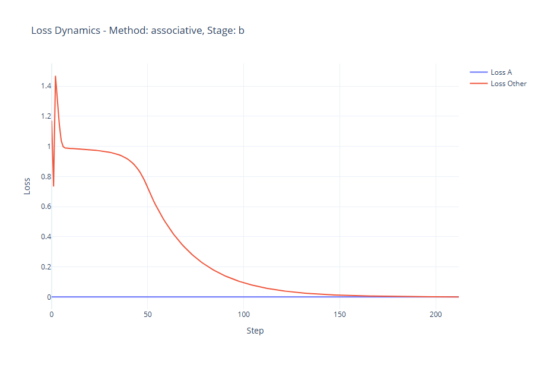

# Experiment 05: Convergence and Memory Integrity under Conflicting Projections

**Related source code**  

The source codes of the experiment are:
1. /examples/ex05_minimal_hpm_memory_update_01_delta.py
2. /examples/ex05_minimal_hpm_memory_update_02_suppresive.py
3. /examples/ex05_minimal_hpm_memory_update_03_associative.py
4. /examples/ex05_minimal_hpm_memory_update_04_reflexive.py

*Additional:*  
The visualization code for the loss dynamics: /examples/ex05_visualize_loss.py

---

## Introduction

The Holographic Projection Memory (HPM) architecture enables memory updates through localized, projection-aligned modifications of a differentiable memory field $W(x) \in \mathbb{R}^C$. Each update is applied via a kernel-weighted path $\ell(t) = o + t \cdot v$, with spatial modulation governed by a Gaussian-like projection kernel $K(x, \ell)$. Unlike traditional models, which rely on global gradient updates, HPM permits direct, inference-time modification through projection errors $\delta \in \mathbb{R}^C$, enabling continual, context-sensitive learning.

In this experiment, we investigate the convergence behavior and memory preservation properties of four distinct update modes (described in Appendix B of HPM documentation) under spatial conflict. Specifically, we examine how new, randomly sampled targets $T^*_B$ affect the integrity of a previously encoded memory $T^*_A$ when their projection paths overlap within the same spatial region of the memory field.

---

## Objective

To evaluate and compare the convergence speed and memory-preserving capacity of the following update modes:

1. **Delta update** $\mathcal{F}_\mathrm{delta}$: unfiltered injection of the projection error.
2. **Suppressive update** $\mathcal{F}_\mathrm{sup}$: reinforcement of existing memory through content-sensitive amplification.
3. **Associative update** $\mathcal{F}_\mathrm{assoc}$: alignment-modulated update with trust weighting.
4. **Reflexive update** $\mathcal{F}_\mathrm{refl}$: conservative update with resistance to untrusted or incoherent changes.

Each method is evaluated based on:

* The final mean squared error (MSE) between the actual projection $T_B$ and target $T^*_B$, indicating convergence success.
* The final MSE between the preserved projection $T_A$ and its original target $T^*_A$, measuring memory integrity.
* The number of steps required to reach a convergence threshold $\text{MSE}(T_B, T^*_B) < \varepsilon$.

---

## Method

Let the memory field be defined as:

$$
W(x) : \mathbb{R}^3 \rightarrow \mathbb{R}^C
$$

with spatial resolution $64 \times 64 \times 64$ and $C = 16$ semantic channels. The memory is initialized with zero mean and small standard deviation $\sigma_\text{init} = 10^{-3}$.

#### Stage A: Reference Memory Encoding

* A fixed projection ray $\ell_A(t) = o_A + t v_A$ is used to imprint a target vector $T^*_A \in \mathbb{R}^C$ into the memory field.
* The projection response is computed as:

$$
T_A = \int W(x) K(x, \ell_A) \, dx
$$

* The memory is updated to reduce the projection error $\delta_A = T^*_A - T_A$.

#### Stage B: Conflicting Projection Learning

* A set of four randomly sampled targets $\{T^*_{B^{(i)}}\}$ is projected through spatially overlapping rays $\ell_B^{(i)}(t)$, all intersecting the previously written region of $\ell_A$.
* For each update mode $\mathcal{F}_k$, the memory is modified by:

$$
\Delta W(x) = \alpha \cdot \mathcal{F}_k\big(x; \, \delta_B, \, W(x), \, K(x, \ell_B)\big)
$$

where $\delta_B = T^*_{B} - T_{B}$ is the projection error.

* At each step, the following are recorded:

  * $\text{MSE}_B = \|T_B - T^*_B\|_2^2$
  * $\text{MSE}_A = \|T_A - T^*_A\|_2^2$

* The experiment continues until $\text{MSE}_B < \varepsilon$ or a maximum number of steps is reached.

This setup allows assessment of convergence behavior under semantic interference and quantitative evaluation of memory degradation caused by overlapping projection paths.

---

## Results

This section summarizes the performance of each memory update mode during Stage B of the experiment, where conflicting projections were introduced. Each method is evaluated with respect to three metrics:

* Final projection error for target B: $\text{MSE}_B = \|T_B - T^*_B\|_2^2$
* Final projection error for preserved target A: $\text{MSE}_A = \|T_A - T^*_A\|_2^2$
* Number of steps to convergence ($\text{MSE}_B < 10^{-3}$)

All values are reported after training on the same memory instance and under identical conditions (random seed is frozen across all experiments).

---

### Summary Table

| Update Mode | Final $\text{MSE}_B$   | Final $\text{MSE}_A$   | Convergence Step |
| ----------- | ---------------------- | ---------------------- | ---------------- |
| Delta       | $9.752 \times 10^{-4}$ | $6.429 \times 10^{-3}$ | 135              |
| Suppressive | $9.917 \times 10^{-4}$ | $5.286 \times 10^{-4}$ | 273              |
| Associative | $9.702 \times 10^{-4}$ | $7.149 \times 10^{-4}$ | 212              |
| Reflexive   | $9.867 \times 10^{-4}$ | $4.713 \times 10^{-4}$ | 16               |

---

### Delta Update

  

* $\text{MSE}_B = 9.752 \times 10^{-4}$
* $\text{MSE}_A = 6.429 \times 10^{-3}$
* Converged in 135 steps

This unfiltered update mode achieves fast convergence to target B but causes severe degradation of previously learned memory A. The absence of semantic filtering results in destructive overwriting when projection paths overlap.

---

### Suppressive Update

  

* $\text{MSE}_B = 9.917 \times 10^{-4}$
* $\text{MSE}_A = 5.286 \times 10^{-4}$
* Converged in 273 steps

Suppressive amplification significantly mitigates memory damage, preserving the structure of A while still achieving low error on B. The convergence is slower due to conservative integration dynamics.

---

### Associative Update

  

* $\text{MSE}_B = 9.702 \times 10^{-4}$
* $\text{MSE}_A = 7.149 \times 10^{-4}$
* Converged in 212 steps

Associative modulation strikes a balance between convergence and preservation. It employs alignment scoring and trustedness weighting, which offer strong protection in semantically dense regions while adapting to new inputs.

---

### Reflexive Update

  

* $\text{MSE}_B = 9.867 \times 10^{-4}$
* $\text{MSE}_A = 4.713 \times 10^{-4}$
* Converged in 16 steps

Reflexive resistance demonstrates both exceptional preservation of A and extremely rapid convergence to B. This mode effectively suppresses updates in incoherent or low-significance regions and adapts efficiently in high-confidence zones.

---

## Observations

During post-experimental sensitivity analysis, both the associative and reflexive update modes exhibited distinct dependencies on the expressiveness of the memory field prior to update. These dependencies have direct implications for the conditions under which each method is effective.

---

### Dependence on Memory Initialization Scale

Let the memory field be initialized as:

$$
W(x) \sim \mathcal{N}(0, \sigma^2 I)
$$

with $\sigma \in \mathbb{R}^+$ denoting the standard deviation of the initial distribution.

**Associative Mode ($\mathcal{F}_\mathrm{assoc}$)**:

* When $\sigma = 10^{-3}$, as used in the main experiment, convergence was achieved in 212 steps with minimal memory damage.
* When $\sigma \gg 10^{-3}$, e.g., $10^{-1}$, convergence accelerated significantly (under 30 steps), and preservation of $T^*_A$ improved.
* When $\sigma \ll 10^{-3}$, e.g., $< 10^{-5}$, the method became unstable: similarity metrics became noisy due to vanishing norms, leading to erratic trust weighting and loss of convergence.

**Reflexive Mode ($\mathcal{F}_\mathrm{refl}$)**:

* At $\sigma = 10^{-3}$, the reflexive mode converged rapidly (16 steps) with almost perfect memory preservation.
* At $\sigma < 10^{-5}$, the effectiveness degraded noticeably. Due to lack of contrast in $W(x)$, resistance modulation failed to detect existing structure, causing increased memory interference and slower adaptation.

---

### Interpretation

Both $\mathcal{F}_\mathrm{assoc}$ and $\mathcal{F}_\mathrm{refl}$ rely on internal state measures derived from the memory field:

* Cosine similarity: $\cos(\theta) = \frac{\langle u, v \rangle}{\|u\|_2 \cdot \|v\|_2}$
* Norms: $\|W(x)\|_2$, used for significance and resistance

These metrics become ill-conditioned in low-variance environments, leading to poor alignment estimation and unreliable modulation weights. Thus, semantic filtering mechanisms built into these update modes require a non-trivial activation baseline to function effectively.

---

### Recommendation

To maximize effectiveness and stability:

> Associative and reflexive memory updates should be applied in regions of the memory field that exhibit pre-existing semantic structure or measurable activation variance ($\sigma \gtrsim 10^{-3}$).

This ensures that internal trust, resistance, and alignment mechanisms operate in a stable numerical regime and maintain their intended memory-preserving behavior.

These results are consistent with the general principle that adaptive update rules based on memory geometry require sufficient signal-to-noise ratio to guide modification trajectories effectively.

---

## Conclusion

This experiment systematically evaluated the convergence and memory-preserving properties of four distinct projection-based update modes in the Holographic Projection Memory (HPM) framework. Each mode was tested under controlled conditions involving spatial overlap between new random target projections $T^*_B$ and an existing memory trace $T^*_A$.

---

### Convergence Capabilities

All four update modes successfully converged to the random target projections $T^*_B$, as measured by final projection error:

* $\text{MSE}_B \leq 10^{-3}$ was achieved consistently across all methods.
* Convergence speed varied significantly:

  * Fastest: Reflexive (16 steps)
  * Slowest: Suppressive (273 steps)

Thus, all update modes are **convergent in principle**, despite differences in internal filtering logic and modulation strength.

---

### Memory Preservation under Conflict

The degree of degradation to previously encoded memory $T^*_A$ varied sharply:

* **Delta** update led to severe memory damage ($\text{MSE}_A \approx 6.4 \times 10^{-3}$).
* **Suppressive** and **associative** modes reduced interference significantly.
* **Reflexive** update preserved prior memory almost perfectly ($\text{MSE}_A < 5 \times 10^{-4}$).

These results confirm that **projection conflict** - even without orthogonality - can lead to memory loss unless actively mitigated.

---

### Mode Trade-offs and Stability

| Mode        | Convergence Speed | Memory Preservation | Sensitivity to Initialization |
| ----------- | ----------------- | ------------------- | ----------------------------- |
| Delta       | High              | Poor                | Low                           |
| Suppressive | Low               | Moderate            | Low                           |
| Associative | Moderate          | Good                | High                          |
| Reflexive   | Very High         | Excellent           | High                          |

The analysis shows that more protective update modes require non-zero semantic activation in the memory field. Both associative and reflexive updates depend on internal estimators (similarity, trust, resistance) which degrade in weak or uninitialized regions.

---

### Implications

* **Convergence and memory retention are not mutually exclusive**: protective updates can learn new content while preserving prior knowledge.
* **Semantic filtering mechanisms**, when appropriately conditioned, offer a reliable strategy for lifelong learning under interference.
* Reflexive update, in particular, demonstrates an ideal combination of convergence speed and memory safety, provided that the memory field has sufficient structure.

---

These findings provide empirical support for the theoretical constructs introduced in Appendix B of the HPM documentation.  
