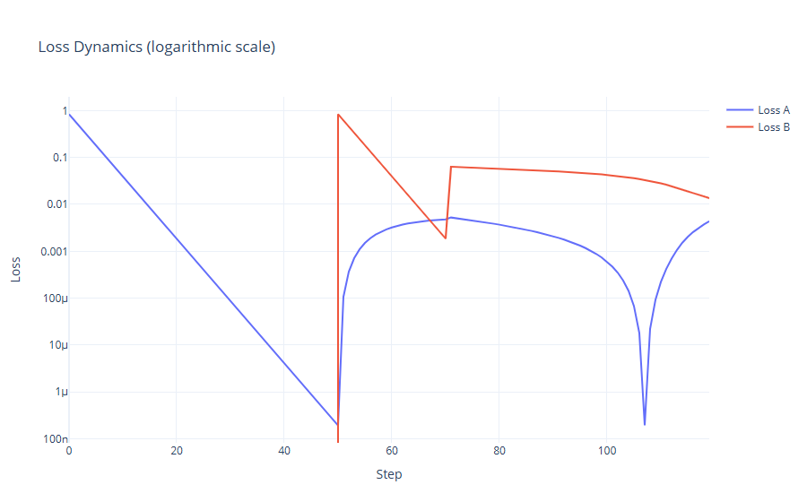
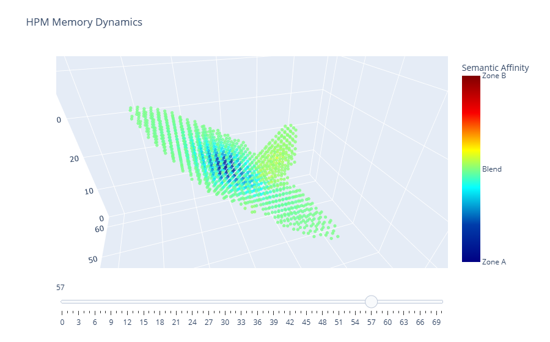

# Experiment 06: Spontaneous Memory Restoration under Associative Updates

**Related source code**  

The source code of the experiment is: /examples/ex06_minimal_hpm_associative_memory_restoration.py  

*Additional:*  
The visualization code for the loss dynamics: /examples/ex06_visualize_loss.py  
The visualization code for the memory dynamics: /examples/ex06_visualise_memory_dynamic.py  

---

## Introduction

This experiment investigates an emergent phenomenon in Holographic Projection Memory (HPM): the spontaneous restoration of previously imprinted memory content following semantic interference, without external supervision. While previous experiments (notably Experiment 05) demonstrated the capacity of associative and reflexive update rules to preserve memory under conflicting projections, here we test whether associative dynamics can additionally reconstitute memory that has already been damaged.

The central hypothesis is that HPM equipped with alignment-sensitive update rules may exhibit attractor-like behavior. In such a system, semantic content encoded into the memory field $W(x)$ can act as a latent attractor basin, which may re-emerge under sufficient associative reinforcement - even if the original memory trace is no longer explicitly present.

This phenomenon, if confirmed, would demonstrate a level of semantic resilience and self-correction absent in traditional memory systems, and would suggest that HPM supports mechanisms akin to content-addressable or autoassociative memory.

---

## Experimental Setup

### Memory Field Configuration

The memory field is defined as a spatial tensor:

$$
W : \mathbb{R}^3 \rightarrow \mathbb{R}^C,
$$

where $C = 16$ is the number of semantic channels. The spatial resolution is fixed to $64 \times 64 \times 64$ voxels. The field is initialized to zero.

The projection kernel $K(x, \ell)$ is constructed using a Gaussian profile:

$$
K(x, \ell) = \exp\left( -\frac{d_\perp^2(x, \ell)}{2\sigma^2} \right) \cdot \exp\left( -\frac{|t(x, \ell)|}{\tau} \right),
$$

where $\sigma = 1.5$ and $\tau = 4.0$.

### Projection Rays

Two fixed projection beams are used:

* **Beam A**: Defined by origin $o_A$ and direction $v_A$, assigned a fixed random target $T^*_A \in \mathbb{R}^C$.
* **Beam B**: Defined by origin $o_B$ and direction $v_B$, initially assigned an orthogonal target $T^\*\_B \in \mathbb{R}^C$ such that $\langle T^\*_A, T^\*_B \rangle = 0$.

The beams are constructed to intersect within the memory volume to ensure semantic conflict.

### Training Procedure

The experiment consists of two sequential stages:

**Stage A (Encoding A)**

* The system imprints $T^*_A$ using beam A.
* Update rule: unfiltered delta injection
  $W(x) \leftarrow W(x) + \alpha \cdot \delta_A \cdot K(x, \ell_A)$
* Number of steps: $50$
* Learning rate: $\alpha = 0.005$

**Stage B (Encoding B (Overwriting A) and Restoration of A)**

* Beam B is activated to write $T^*_B$ through overlapping geometry.
* First 20 steps: delta updates
* Remaining 50 steps: associative updates:
  $W(x) \leftarrow W(x) + \alpha \cdot \mathcal{F}_{\mathrm{assoc}}(x; \delta_B, W(x), K(x, \ell_B))$
* Associative update rule is modulated by alignment and local magnitude of memory:
  $\mathcal{F}_{\mathrm{assoc}}(x) = A(x) \cdot U'(x)$

where $U'(x)$ is the combined update vector and $A(x)$ is a scalar trust coefficient.

Throughout both phases, the projection errors for A and B are recorded at each step:

$$
\text{MSE}_A = \lVert T_A - T^*_A \rVert _2^2, \quad \text{MSE}_B = \lVert T_B - T^\*_B \rVert _2^2.
$$

The system is monitored for signs of restoration of $T^*_A$ during Stage B, despite the absence of any direct updates using beam A.

---

## Results

### Loss Dynamics Over Time

The mean squared errors (MSE) for both projections A and B were recorded at every training step. These trajectories reveal three distinct regimes:

* **Stage A (Steps 0–49)**: Projection A converges rapidly from $\text{MSE}_A \approx 0.83$ to below $10^{-6}$ under delta updates, confirming successful memory imprinting.
* **Stage B, Phase I (Steps 50–70)**: Introduction of conflicting target $T^*_B$ leads to immediate degradation of A, with $\text{MSE}_A$ rising to over $5 \times 10^{-3}$.
* **Stage B, Phase II (Steps 71–119)**: After switching to associative updates, $\text{MSE}_A$ unexpectedly decreases, reaching a minimum of $1.9 \times 10^{-7}$ at step 107, despite no direct reinforcement of A.

This behavior indicates spontaneous memory restoration. Meanwhile, $\text{MSE}_B$ steadily decreases as the system adapts to the new target.

**Figure 1: Log-Scale Loss Curves**  
  
> Mean squared errors $\text{MSE}\_A$ and $\text{MSE}\_B$ plotted over all steps using logarithmic scaling to highlight subtle dynamics.

### Spatial Projection and Memory State

At the point of maximal restoration (step 107), a 3D visualization of the memory field $W(x)$ shows distinct semantic traces along both beams. Beam A's pathway, which had previously faded, exhibits reemerging structure aligned with the original target $T^\*_A$. This occurs despite $T^\*_A$ being excluded from the update rule after step 49.

**Figure 2: 3D Memory Field Visualization**  
  
> Cross-sectional rendering of $W(x)$ at step 107, with overlay of beam directions $\ell_A$ and $\ell_B$. Reconstructed memory structure along $\ell_A$ confirms spontaneous reactivation.

---

## Conclusion

This experiment confirms the existence of spontaneous memory restoration in Holographic Projection Memory (HPM) when utilizing associative update rules. After initial semantic interference caused by the projection of an orthogonal target along an intersecting path, the memory trace of a previously imprinted target was observed to re-emerge solely due to continued updates along the conflicting beam, without any direct reinforcement.

This behavior demonstrates that the associative update function $\mathcal{F}\_{\mathrm{assoc}}$, which modulates updates based on alignment and local memory density, is capable not only of preserving semantic content but also of reactivating latent memory patterns. The emergence of such attractor-like dynamics suggests that HPM embodies properties of content-addressable memory, even in the absence of explicit recall mechanisms.

Moreover, this restoration effect is not universal: it requires repeated updates with a fixed projection target and does not occur when projection targets are randomized, emphasizing the role of semantic consistency in triggering associative convergence.

These findings indicate that the associative write mechanism may serve as a foundation for advanced stabilization or recall strategies in future extensions of the HPM framework. Further theoretical and empirical investigation is needed to fully characterize the conditions under which such restoration occurs and to determine whether it can be generalized into a principled retrieval mechanism.
